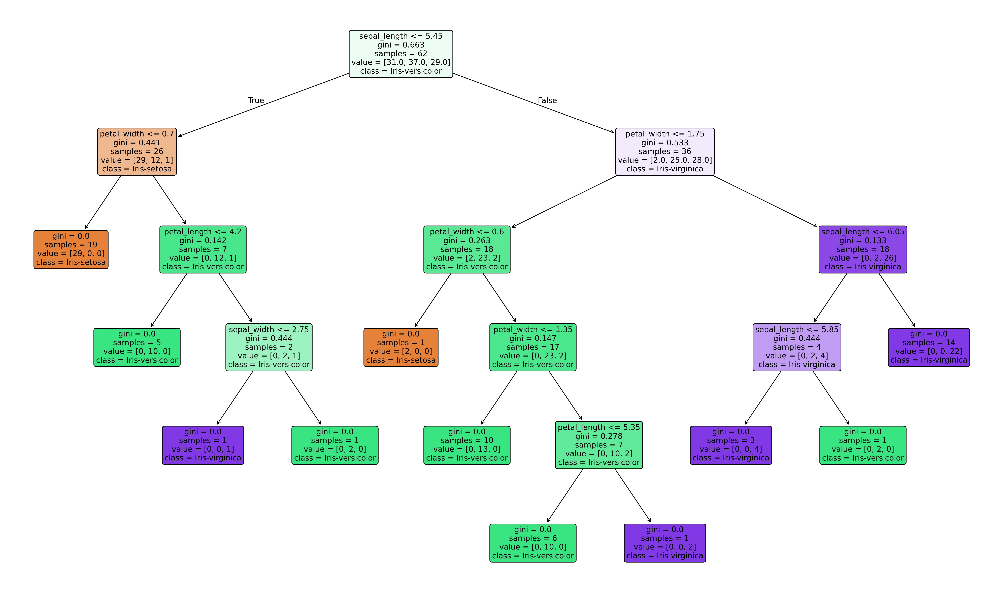
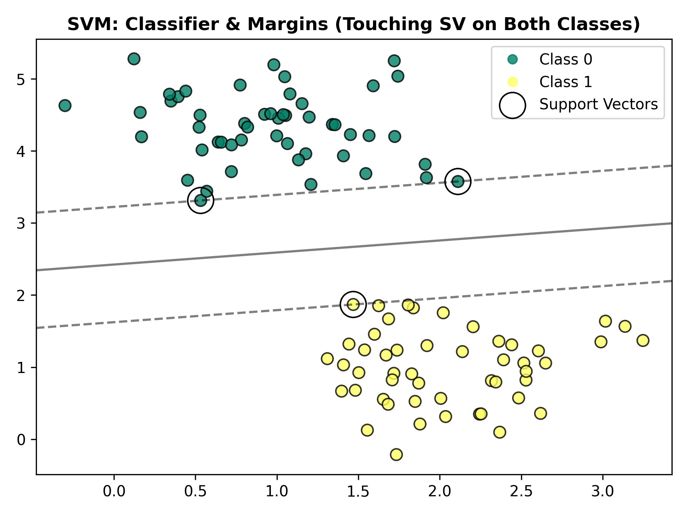
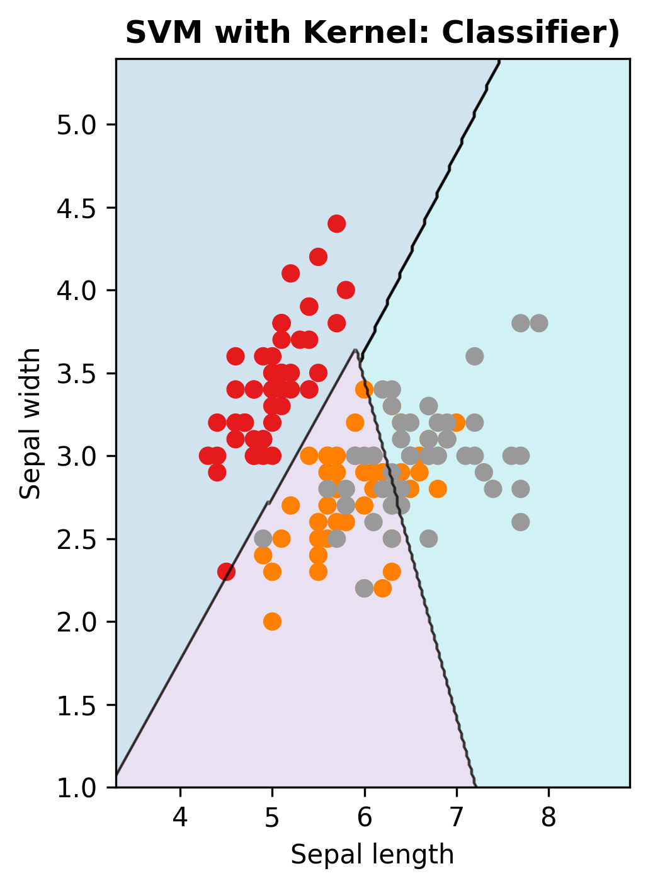

<details>
<summary><h1>Supervised Learning</h1></summary>

A type of machine learning that trained the model using labeled dataset to predict outcomes.

## 1.   K-Nearest Neighbors

```
neighbors.KNeighborsClassifier
```

- **Classification**: Assign the test data point to the class that appears most frequently among the k-nearest neighbors
- **Regression**: Assign the test data point the average of the k-nearest neighbors' values

<p align="center">
    
</p>

<table>
    <thead>
        <tr>
            <th align="center" width="50%">Strength</th>
            <th align="center" width="50%">Weakness</th>
        </tr>
    </thead>
    <tbody>
            <tr>
                <td valign="top">
                    <ul>
                        <li>Simple and easy to understand.</li>
                        <li>Versatile as it can be used for classification and regression.</li>
                    </ul>
                </td>
                <td valign="top">
                    <ul>
                        <li>High memory storage required.</li>
                        <li>Does not work well on datasets with many features.</li>
                        <li>Slow prediction if N is big.</li>
                    </ul>
                </td>
            </tr>
    </tbody>
</table>


## 2.   Linear Regression

```
linear_model.LinearRegression
```

- **Regression**: Use a single feature to predict the target based on the line of regression (best-fit line)

<p align="center">
    
</p>

<table>
    <thead>
            <tr>
                <th align="center" width="50%">Strength</th>
                <th align="center" width="50%">Weakness</th>
            </tr>
    </thead>
    <tbody>
        <tr>
            <td valign="top">
                <ul>
                    <li>Fast to train and predict.</li>
                    <li>Easy to understand using formulas.</li>
                </ul>
            </td>
            <td valign="top">
                <ul>
                    <li>Coeeficient might be hard to interpret if the dataset has highly correlated features.</li>
                    <li>Does not work well on samll datasets.</li>
                </ul>
            </td>
        </tr>
    </tbody>
</table>


## 3.   Naive Bayes

```
naive_bayes.GaussianNB (features are continuous variables)
naive_bayes.BernoulliNB (features are discrete counts)
naive_bayes.MultinomialNB features that are binary)
```
- Classification: Calculates the probability of a sample belonging to a particular class based on the probabilities of its features

<p align="center">
    
</p>

<table>
    <thead>
        <tr>
            <th align="center" width="50%">Strength</th>
            <th align="center" width="50%">Weakness</th>
        </tr>
    </thead>
  <tbody>
        <tr>
            <td valign="top">
                <ul>
                    <li>Highly scalable.</li>
                    <li>Reuqire less training data.</li>
                    <li>Can handle continuous, discrete and binary data.</li>
                </ul>
            </td>
            <td valign="top">
                <ul>
                    <li>Strong feature independence, as it is almost impossible to have a set of features which are completely independent of each other.</li>
                    <li>If the category of a data has zero frequency, NB cannot make prediction.</li>
                </ul>
            </td>
        </tr>
  </tbody>
</table>


## 4.   Decision Trees

```
tree.DecisionTreeClassifier
```

- Classification: Classify data into different classes based on the values of input features
- Regression: Predict continuous values based on the values of input features

<p align="center">
    
</p>

<table>
    <thead>
        <tr>
            <th align="center" width="50%">Strength</th>
            <th align="center" width="50%">Weakness</th>
        </tr>
    </thead>
  <tbody>
        <tr>
            <td valign="top">
                <ul>
                    <li>Easily visualized and understood.</li>
                    <li>No preprocessing like normalization or standardization.</li>
                    <li>Input feature can be a mix of different data types.</li>
                </ul>
            </td>
            <td valign="top">
                <ul>
                    <li>Tend to overfit and provide poor generalization.</li>
                </ul>
            </td>
        </tr>
  </tbody>
</table>


## 5.   Random Forest

```
ensemble.RandomForestClassifier
```

- Classification: Mode of decision trees' prediction
- Regression: Mean of decision trees' prediction

<p align="center">
    
</p>

<table>
    <thead>
        <tr>
            <th align="center" width="50%">Strength</th>
            <th align="center" width="50%">Weakness</th>
        </tr>
    </thead>
  <tbody>
        <tr>
            <td valign="top">
                <ul>
                    <li>Robustness to overfitting.</li>
                    <li>High accuracy.</li>
                    <li>RF can provide information about the importance of each feature in the model.</li>
                </ul>
            </td>
            <td valign="top">
                <ul>
                    <li>More time and resources consuming.</li>
                    <li>More complex and less intuitive.</li>
                </ul>
            </td>
        </tr>
  </tbody>
</table>


## 6.   Support Vector Machine

```
svm.SVC
```

- Classification: Find the hyperplane with maximum margin that separates the data points into different classes.
- Regression: Similar to classification

<p align="center">
    
    
</p>

<table>
    <thead>
        <tr>
            <th align="center" width="50%">Strength</th>
            <th align="center" width="50%">Weakness</th>
        </tr>
    </thead>
  <tbody>
        <tr>
            <td valign="top">
                <ul>
                    <li>Works well with high dimensional space (with kernel).</li>
                    <li>Requires very less memory.</li>
                </ul>
            </td>
            <td valign="top">
                <ul>
                    <li>Time consuming and no suitable with large datasets.</li>
                    <li>Do not work well with overlapping classes.</li>
                </ul>
            </td>
        </tr>
  </tbody>
</table>
</details>


<details>
<summary><h1>Unsupervised Learning</h1></summary>
</details>