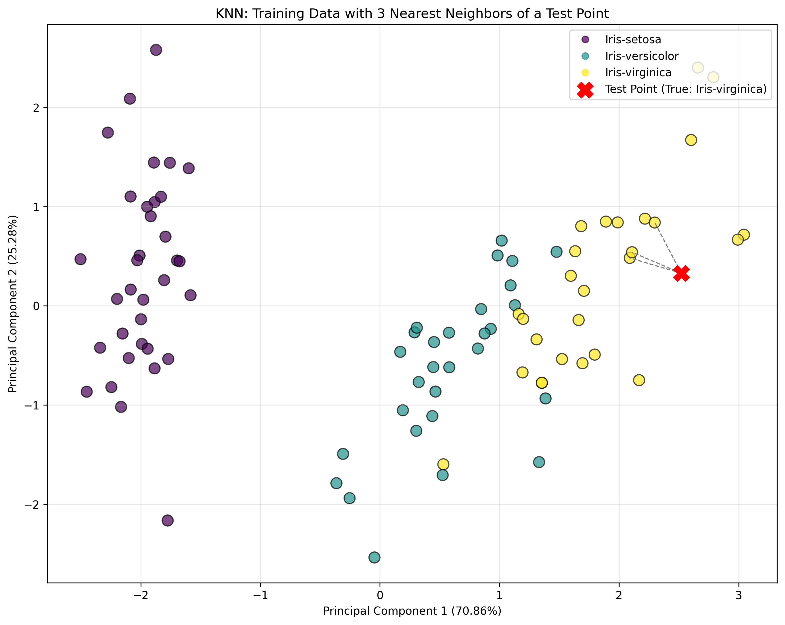
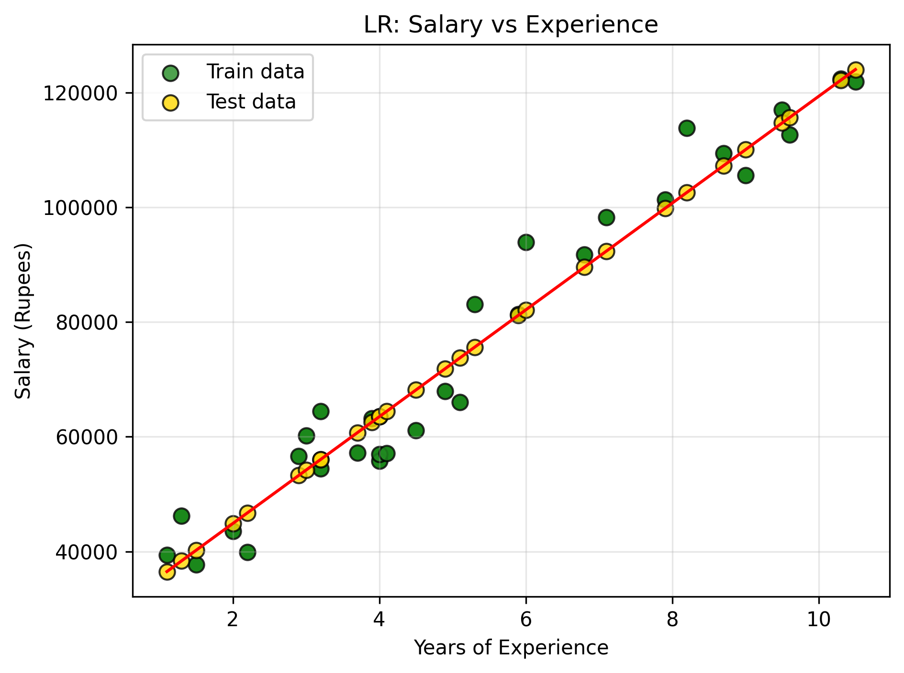
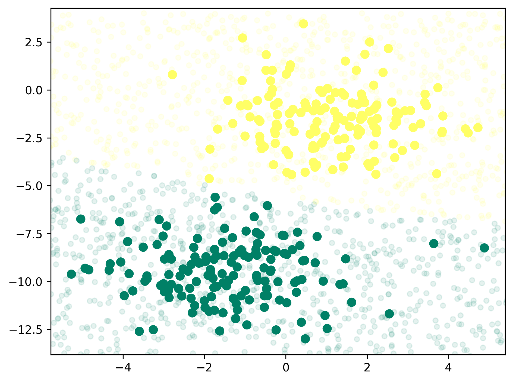
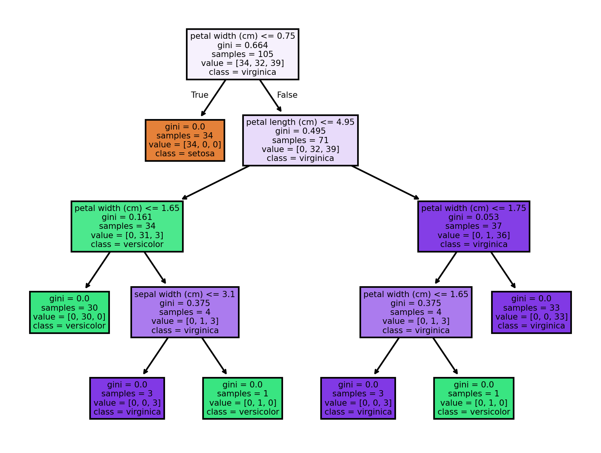

# Supervised Learning
A type of machine learning that trained the model using labeled dataset to predict outcomes

<h3>K-Nearest Neighbors<h3>

`neighbors.KNeighborsClassifier`

| Classification | Regression |
| -------------- | ---------- |
| Assign the test data point to the class that appears most frequently among the k-nearest neighbors | Assign the test data point the average of the k-nearest neighbors' values |

<table>
    <thead>
        <tr>
            <th align="center" width="50%">Strength</th>
            <th align="center" width="50%">Weakness</th>
        </tr>
    </thead>
    <tbody>
            <tr>
                <td valign="top">
                    <ul>
                        <li>Simple and easy to understand.</li>
                        <li>Versatile as it can be used for classification and regression.</li>
                    </ul>
                </td>
                <td valign="top">
                    <ul>
                        <li>High memory storage required.</li>
                        <li>Does not work well on datasets with many features.</li>
                        <li>Slow prediction if N is big.</li>
                    </ul>
                </td>
            </tr>
    </tbody>
</table>

<h3>Linear Regression<h3>

`linear_model.LinearRegression`

| Classification | Regression |
| -------------- | ---------- |
| N/A | Use a single feature to predict the target based on the line of regression (best-fit line) |

<table>
    <thead>
            <tr>
                <th align="center" width="50%">Strength</th>
                <th align="center" width="50%">Weakness</th>
            </tr>
    </thead>
    <tbody>
        <tr>
            <td valign="top">
                <ul>
                    <li>Fast to train and predict.</li>
                    <li>Easy to understand using formulas.</li>
                </ul>
            </td>
            <td valign="top">
                <ul>
                    <li>Coeeficient might be hard to interpret if the dataset has highly correlated features.</li>
                    <li>Does not work well on samll datasets.</li>
                </ul>
            </td>
        </tr>
    </tbody>
</table>

<h3>Naive Bayes<h3>

`naive_bayes.GaussianNB` (features are continuous variables)
`naive_bayes.BernoulliNB` (features are discrete counts)
`naive_bayes.MultinomialNB` features that are binary)

| Classification | Regression |
| -------------- | ---------- |
| Calculates the probability of a sample belonging to a particular class based on the probabilities of its features | N/A |

<table>
    <thead>
        <tr>
            <th align="center" width="50%">Strength</th>
            <th align="center" width="50%">Weakness</th>
        </tr>
    </thead>
  <tbody>
        <tr>
            <td valign="top">
                <ul>
                    <li>Highly scalable.</li>
                    <li>Reuqire less training data.</li>
                    <li>Can handle continuous, discrete and binary data.</li>
                </ul>
            </td>
            <td valign="top">
                <ul>
                    <li>Strong feature independence, as it is almost impossible to have a set of features which are completely independent of each other.</li>
                    <li>If the category of a data has zero frequency, NB cannot make prediction.</li>
                </ul>
            </td>
        </tr>
  </tbody>
</table>

<h3>Decision Trees<h3>

`tree.DecisionTreeClassifier`

| Classification | Regression |
| -------------- | ---------- |
| Classify data into different classes based on the values of input features | Predict continuous values based on the values of input features |

<table>
    <thead>
        <tr>
            <th align="center" width="50%">Strength</th>
            <th align="center" width="50%">Weakness</th>
        </tr>
    </thead>
  <tbody>
        <tr>
            <td valign="top">
                <ul>
                    <li>Easily visualized and understood.</li>
                    <li>No preprocessing like normalization or standardization.</li>
                    <li>Input feature can be a mix of different data types.</li>
                </ul>
            </td>
            <td valign="top">
                <ul>
                    <li>Tend to overfit and provide poor generalization.</li>
                </ul>
            </td>
        </tr>
  </tbody>
</table>

# Unsupervised Learning